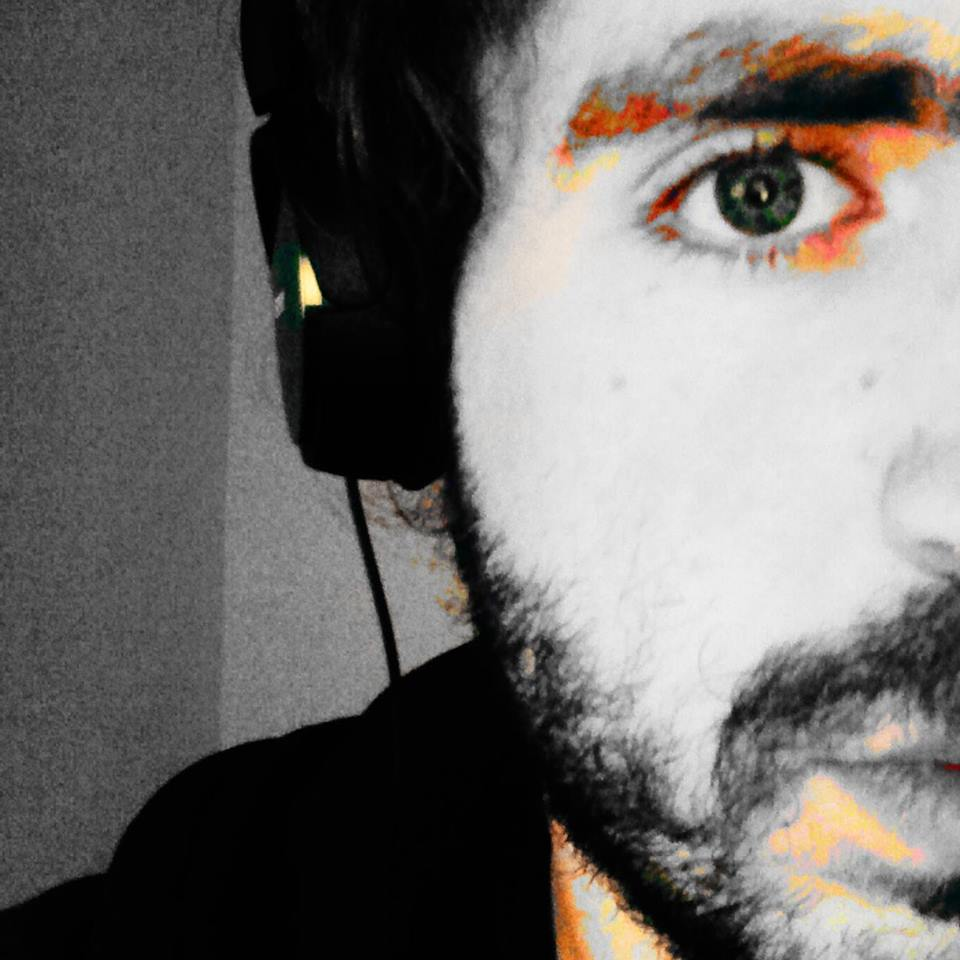

    <h1 class="awesomeh1">./me</h1>
    

        
    

    

         
        <h2><b>Software Engineer</b></h2>
        <h3>Research by <b>day</b>, open-source by <b>night.</b></h3>
         
        <h3 class="awesomeh3"><b>Reach me via email</b></h3>
        

            <b>nikolas.mpompetsis</b> at <b>gmail</b> dot <b>com</b>
            Don't copy my email. It won't work!
        

    

